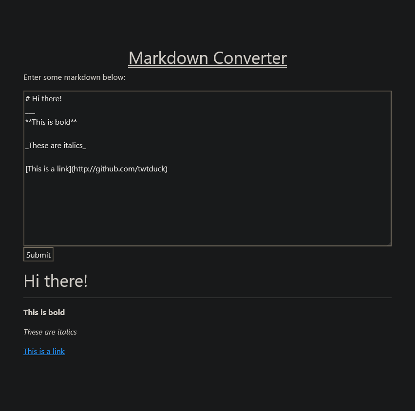

# Markdown Converter Web App



## Purpose

This app allows the easy conversion of markdown into HTML, right in the browser!

## Usage

1. Ensure Python 3 is installed and up to date
2. Set up a virtual environment,
```bash
$ python3 -m venv venv
$ ./venv/Scripts/activate
$ pip3 install Flask
$ pip3 install markdown
```
3. Run the main.py script:
```bash
$ python3 main.py 
```
4. Visit port 5000 of your machine in a browser. The application is accessible to all hosts which can reach the server on that port.
